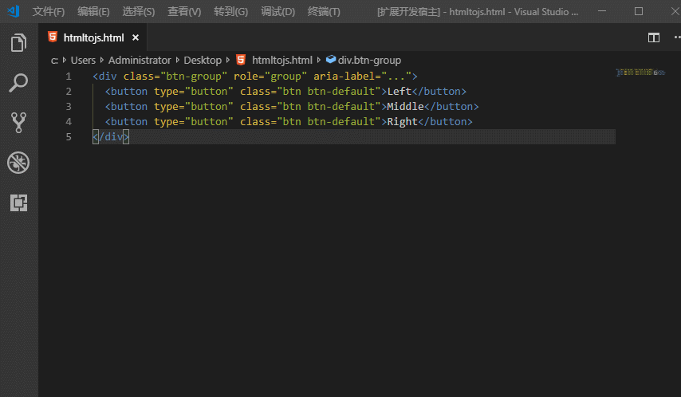

# htmlTojs

**example**

```html
'<div class="btn-group" role="group" aria-label="...">'+
'<button type="button" class="btn btn-default">Left</button>'+
'<button type="button" class="btn btn-default">Middle</button>'+
'<button type="button" class="btn btn-default">Right</button>'+
'</div>';
```


# htmlTojs str

**example**

```html
var html_str = "";
html_str += "<div class="btn-group" role="group" aria-label="...">";
html_str += "<button type="button" class="btn btn-default">Left</button>";
html_str += "<button type="button" class="btn btn-default">Middle</button>";
html_str += "<button type="button" class="btn btn-default">Right</button>";
html_str += "</div>";
```

